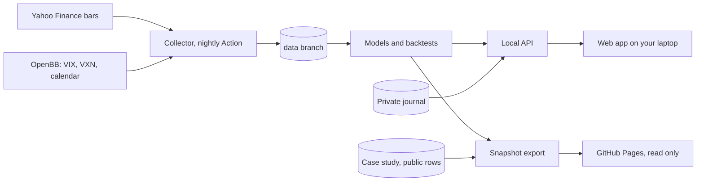

# Architecture

The source of the diagram in the README.

```mermaid
flowchart LR
    Y[Yahoo Finance bars] --> C[Collector, nightly Action]
    O[OpenBB: VIX, VXN, calendar] --> C
    C --> D[(data branch)]
    D --> M[Models and backtests]
    M --> A[Local API]
    A --> W[Web app on your laptop]
    J[(Private journal)] --> A
    M --> S[Snapshot export]
    P[(Case study, public rows)] --> S
    S --> G[GitHub Pages, read only]
```
